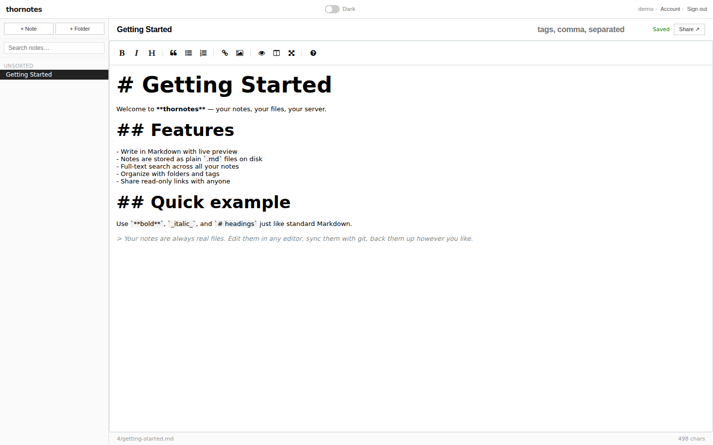
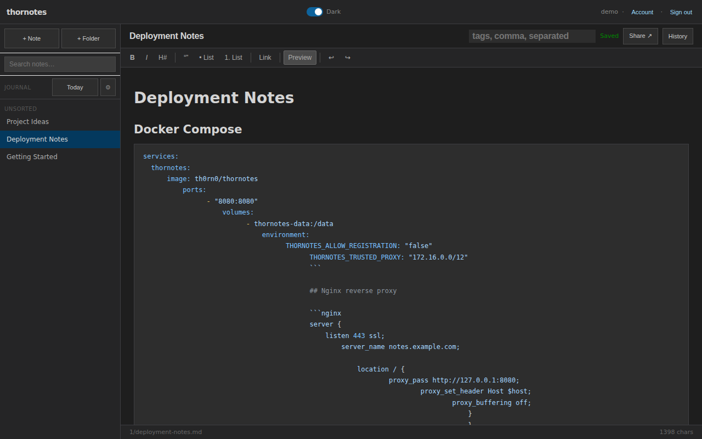

# thornotes

> **Disclaimer:** This is a vibe-coded project built for personal research and experimentation. It is not production-hardened. Use at your own risk.

A self-hosted Markdown note-taking app with file-as-canonical storage. Every note is a real `.md` file on disk. The database is an index, not the source of truth.





## Features

- Write notes in Markdown with a split-pane editor (CodeMirror 6 — syntax-aware, live preview)
- Syntax highlighting for fenced code blocks — ` ```go `, ` ```yaml `, ` ```json `, and [180+ languages](https://highlightjs.org/)
- Folder tree with lazy-loaded notes
- **Folder overview** — click a folder to see a card grid of all its notes with content snippets
- **Wiki-style note linking** — use `[[Note Title]]` in any note to link to another note; clicking the link in preview opens it, building a navigable note graph
- Full-text search with snippet highlighting
- Tags
- Shareable read-only note links
- MCP server — full CRUD over notes and folders via 14 tools; read-only or read-write token scopes; works with Claude Desktop, Open WebUI, Cursor, and any MCP-compatible client
- API tokens for programmatic access with read/write scope and optional per-folder permissions
- Live sync — edits made directly to `.md` files on disk are detected and pushed to open browser tabs via SSE
- Git-backed version history — opt-in; every save, delete, and folder rename becomes a commit so you can preview and restore any previous version
- Multi-theme: Light, Dark, Catppuccin, Nord, Tokyo Night, Solarized — each with per-theme syntax highlighting tuned for that palette
- **Markdown formatting toolbar** — bold, italic, heading, blockquote, ordered and unordered lists, link, table (with column-alignment formatter), undo/redo
- **Right-click context menu** in the editor — bold, italic, blockquote, list, link, and table formatting available on selection
- Line numbers toggle in the editor toolbar; character and line count in the status bar
- Daily journal with multi-journal support
- Import `.md` files or `.zip` archives (folder structure preserved)

## Quick start with Docker

The image is published for `linux/amd64` and `linux/arm64` (Raspberry Pi, NAS, Apple Silicon via Rosetta).

```sh
docker run -d \
  --name thornotes \
  -v thornotes-data:/data \
  -p 8080:8080 \
  th0rn0/thornotes
```

Open [http://localhost:8080](http://localhost:8080), register an account, and start writing.

### Docker Compose

```yaml
services:
  thornotes:
    image: th0rn0/thornotes
    container_name: thornotes
    restart: unless-stopped
    ports:
      - "8080:8080"
    volumes:
      - thornotes-data:/data
    environment:
      THORNOTES_ADDR: ":8080"
      THORNOTES_DB: "/data/thornotes.db"
      THORNOTES_NOTES_ROOT: "/data/notes"
      THORNOTES_ALLOW_REGISTRATION: "true"   # set to "false" after first user
      # THORNOTES_TRUSTED_PROXY: "172.16.0.0/12"  # uncomment if behind a proxy
      # THORNOTES_ENABLE_GIT_HISTORY: "true"      # uncomment to record every save as a git commit

volumes:
  thornotes-data:
```

Save as `docker-compose.yml` and run:

```sh
docker compose up -d
```

The `/data` volume holds the SQLite database (`thornotes.db`) and all note files (`notes/`). Back it up with any standard volume backup tool.

### Docker Compose with MariaDB

For multi-user or hosted deployments, swap the SQLite default for MariaDB:

```yaml
services:
  thornotes:
    image: th0rn0/thornotes
    container_name: thornotes
    restart: unless-stopped
    ports:
      - "8080:8080"
    volumes:
      - thornotes-notes:/data/notes
    environment:
      THORNOTES_DB_DRIVER: "mysql"
      THORNOTES_DB_HOST: "db:3306"
      THORNOTES_DB_NAME: "thornotes"
      THORNOTES_DB_USER: "thornotes"
      THORNOTES_DB_PASSWORD: "secret"
      THORNOTES_NOTES_ROOT: "/data/notes"
      THORNOTES_ALLOW_REGISTRATION: "true"
    depends_on:
      db:
        condition: service_healthy

  db:
    image: mariadb:11
    restart: unless-stopped
    environment:
      MARIADB_DATABASE: thornotes
      MARIADB_USER: thornotes
      MARIADB_PASSWORD: secret
      MARIADB_ROOT_PASSWORD: rootsecret
    volumes:
      - thornotes-db:/var/lib/mysql
    healthcheck:
      test: ["CMD", "healthcheck.sh", "--connect", "--innodb_initialized"]
      interval: 5s
      timeout: 5s
      retries: 10

volumes:
  thornotes-notes:
  thornotes-db:
```

## Configuration

All options are available as environment variables and CLI flags.

| Environment variable | Flag | Default | Description |
|---|---|---|---|
| `THORNOTES_ADDR` | `--addr` | `:8080` | Listen address |
| `THORNOTES_DB_DRIVER` | `--db-driver` | `sqlite` | Database driver: `sqlite` or `mysql` |
| `THORNOTES_DB` | `--db` | `thornotes.db` | SQLite database path (sqlite driver only) |
| `THORNOTES_DB_HOST` | `--db-host` | `localhost:3306` | MySQL/MariaDB host:port (mysql driver only) |
| `THORNOTES_DB_NAME` | `--db-name` | `thornotes` | MySQL/MariaDB database name (mysql driver only) |
| `THORNOTES_DB_USER` | `--db-user` | _(none)_ | MySQL/MariaDB username (mysql driver only) |
| `THORNOTES_DB_PASSWORD` | `--db-password` | _(none)_ | MySQL/MariaDB password (mysql driver only) |
| `THORNOTES_NOTES_ROOT` | `--notes-root` | `notes` | Root directory for `.md` files. Verified writable at startup — thornotes exits early if the directory is read-only or inaccessible. |
| `THORNOTES_ALLOW_REGISTRATION` | `--allow-registration` | `true` | Allow new user sign-up |
| `THORNOTES_SECURE_COOKIES` | `--secure-cookies` | `false` | Set `Secure` flag on session cookie — enable when serving over HTTPS |
| `THORNOTES_TRUSTED_PROXY` | `--trusted-proxy` | _(none)_ | CIDR of trusted reverse proxy (e.g. `10.0.0.0/8`) — enables `X-Forwarded-For` for rate limiting |
| `THORNOTES_WATCH_INTERVAL` | `--watch-interval` | `30s` | How often to poll the notes directory for external file changes. Set to `0` to disable |
| `THORNOTES_SKIP_RECONCILIATION` | `--skip-reconciliation` | `false` | Skip the startup hash-check scan (safe on trusted restarts with large note corpora) |
| `THORNOTES_ENABLE_GIT_HISTORY` | `--enable-git-history` | `false` | Record every note save/delete as a git commit in the notes directory. Enables the history API (`GET /api/v1/notes/:id/history`, `GET /api/v1/notes/:id/history/:sha`, `POST /api/v1/notes/:id/history/:sha/restore`). Uses [go-git](https://github.com/go-git/go-git) — no git binary required. |

## Running behind a reverse proxy

thornotes expects to be proxied behind nginx, Caddy, or similar. Set `THORNOTES_TRUSTED_PROXY` to your proxy's IP/CIDR so the rate limiter sees real client IPs from `X-Forwarded-For`.

Minimal nginx config:

```nginx
server {
    listen 443 ssl;
    server_name notes.example.com;

    location / {
        proxy_pass http://127.0.0.1:8080;
        proxy_set_header Host $host;
        proxy_set_header X-Forwarded-For $remote_addr;
        # SSE requires buffering off
        proxy_buffering off;
        proxy_cache off;
    }
}
```

## MCP integration

thornotes implements the [MCP Streamable HTTP transport (2025-03-26)](https://spec.modelcontextprotocol.io/specification/2025-03-26/basic/transports/#streamable-http) at `/mcp` (`POST`, `GET`, `DELETE`). AI assistants can read and write your notes as MCP tools and resources.

1. Open the **Account** modal in the app
2. Create an API token
3. Copy the connection snippet and paste it into your AI assistant's MCP config

**Transport endpoints:**

| Method | Endpoint | Purpose |
|--------|----------|---------|
| `POST` | `/mcp` | Client → server messages (requests + notifications) |
| `GET` | `/mcp` | Server → client SSE stream (keepalive; thornotes has no server-initiated messages) |
| `DELETE` | `/mcp` | Terminate a session |

All three endpoints require `Authorization: Bearer <token>`.

**Token scopes:** When creating an API token you can choose **Read + Write** (default) or **Read only**. Read-only tokens can call all read tools but write tools return `403 Forbidden`.

**Folder-scoped tokens:** On top of the global scope, an API token can be restricted to specific folders. In the **Account** modal expand *"Limit to specific folders"* when creating a token (or press *Permissions* on an existing token) and pick one or more folders with per-folder `read` or `write` access. The **Permissions** modal also lets you flip the token's global scope between Read only and Read + Write without regenerating the token. Rules:

- A token with **no folder permissions** behaves as before — its global scope applies everywhere.
- A token with **one or more folder permissions** is a whitelist: the MCP handler denies access to every folder not covered by a grant.
- Permissions **cascade to descendants**: a `write` grant on `Work` covers `Work/Projects` and `Work/Projects/Q3`, unless an inner folder carries its own (tighter) grant.
- A grant on the root (the implicit "/" row) covers unfiled notes and acts as the fallback for folders with no direct grant.
- Notes inherit from their folder — you cannot set permissions on individual notes.
- `write` implies `read`. You cannot grant `write` on a token whose global scope is `read`.
- Listings (`list_notes`, `list_folders`, `search_notes`, `list_tags`, `find_notes_by_tag`, `find_folders`, and the MCP `resources/list`) are automatically filtered so the client only sees allowed folders.

Permissions can also be managed via the API:

```bash
# List tokens (includes folder_permissions on each)
curl -b cookies.txt http://localhost:8080/api/v1/account/tokens

# Replace the full set of folder permissions for a token, and optionally change
# its global scope in the same call. Omit "scope" to leave it unchanged.
curl -b cookies.txt -X PUT -H 'Content-Type: application/json' \
     -H 'X-CSRF-Token: ...' \
     -d '{"scope":"readwrite","folder_permissions":[{"folder_id":42,"permission":"write"},{"folder_id":null,"permission":"read"}]}' \
     http://localhost:8080/api/v1/account/tokens/<id>/permissions

# Send an empty folder_permissions array to clear all folder permissions
# (revert to global scope). "scope" is still optional here.
curl -b cookies.txt -X PUT -H 'Content-Type: application/json' \
     -H 'X-CSRF-Token: ...' -d '{"folder_permissions":[]}' \
     http://localhost:8080/api/v1/account/tokens/<id>/permissions
```

### Available tools

#### Read tools (all token scopes)

| Tool | Description |
|------|-------------|
| `list_notes` | List note metadata (id, title, tags, folder_id, updated_at). Pass `folder_id` to scope to one folder, or omit for all notes. |
| `get_note` | Fetch the full markdown content and metadata of a note by ID. |
| `search_notes` | Full-text search across titles and bodies. Optional `tags` filter (AND logic). Returns id, title, snippet. |
| `list_folders` | Return the complete folder hierarchy (id, parent_id, name, note_count). |
| `find_folders` | Case-insensitive substring search over folder names. |
| `find_notes_by_tag` | Return notes that carry ALL of the specified tags. No text query needed. |
| `list_tags` | Return all tags in use, sorted alphabetically. |

#### Write tools (readwrite tokens only)

| Tool | Description |
|------|-------------|
| `create_note` | Create a note with title, optional content, optional folder_id, optional tags. Returns the new note with its id. |
| `update_note` | Replace the full markdown content of a note. Optimistic concurrency handled automatically. |
| `rename_note` | Update a note's title and/or tags without touching content. |
| `move_note` | Move a note to a different folder (or to root). |
| `delete_note` | Permanently delete a note and its .md file. |
| `create_folder` | Create a folder, optionally nested inside an existing folder. |
| `rename_folder` | Rename a folder (updates all descendant disk paths atomically). |
| `move_folder` | Move a folder to a different parent (circular moves are rejected). |
| `delete_folder` | Delete a folder and all its contents permanently. |

**Available resources:** Every note is also exposed as a `note://<id>` resource (MIME type `text/markdown`) for clients that use resource reads instead of tool calls.

### Claude Desktop

Edit `claude_desktop_config.json` (Mac: `~/Library/Application Support/Claude/claude_desktop_config.json`, Windows: `%APPDATA%\Claude\claude_desktop_config.json`):

```json
{
  "mcpServers": {
    "thornotes": {
      "url": "http://localhost:8080/mcp",
      "headers": {
        "Authorization": "Bearer <your-token>"
      }
    }
  }
}
```

Restart Claude Desktop after saving.

### Open WebUI

Open WebUI supports MCP servers via its built-in tools pipeline.

1. Go to **Admin Panel → Tools → Add Tool**
2. Set **Type** to `MCP`
3. Set **Server URL** to `http://localhost:8080/mcp`
4. Add a custom header: `Authorization: Bearer <your-token>`
5. Save — the thornotes tools appear in the tool selector for any model

If your Open WebUI instance runs in Docker, use the Docker host address instead of `localhost` (e.g. `http://host.docker.internal:8080/mcp` on Mac/Windows, or the Docker bridge IP on Linux).

## Importing notes

thornotes can import existing Markdown files via the **↑ Import** button in the sidebar, or directly via the API.

```
POST /api/v1/import
Content-Type: multipart/form-data
```

| File type | Behaviour |
|-----------|-----------|
| `.md` | Imported as a single root-level note. The filename (minus `.md`) becomes the title. |
| `.zip` | Each `.md` file inside is imported as a note. Directories in the ZIP become folders. Non-`.md` files are silently skipped. Duplicate titles within the same folder are skipped. |

Maximum upload size: **10 MB**.

**Response:**

```json
{ "notes_created": 5, "folders_created": 2 }
```

Requires an active session (same auth as the browser app) and a valid CSRF token (`X-CSRF-Token` header, obtained from `GET /api/v1/csrf`).

## Journals

Journals turn thornotes into a daily writing tool. A journal is a named container (e.g. `Personal`, `Work`) that owns a predictable folder tree and a one-click shortcut to today's entry. Journals are a zero-config feature — no env vars or flags required.

### What a journal is

- A journal is just a name plus a root folder on disk with the same name.
- Each entry is a normal `.md` note filed under `{journalName}/{year}/{month}/YYYY-MM-DD.md` — e.g. `Personal/2026/04/2026-04-18.md`.
- Today's entry is auto-tagged with `journal entry` and the journal name, so you can find all entries with `find_notes_by_tag` or the tag filter in the UI.
- The folder tree is materialised on first use, so entries remain accessible through the normal folder sidebar even without the journals UI.

### Creating a journal (UI)

1. In the sidebar, click the **⚙** (manage) button in the Journal section. If you have no journals yet, clicking **Today** opens the same modal.
2. Type a name (e.g. `Personal`) and click **+ Add**. The root folder is created immediately.
3. You can add as many journals as you like. When you have more than one, a dropdown appears next to the **Today** button so you can pick which journal the shortcut targets.

### Opening today's entry

Click **Today** in the sidebar. thornotes:

1. Ensures the `{journal}/{year}/{month}/` folders exist.
2. Looks up today's date in the user's local timezone (the browser sends its IANA timezone via the `tz` query param).
3. Returns the existing entry if there is one, or creates a fresh `YYYY-MM-DD.md` note with the `journal entry` + journal-name tags.

Clicking **Today** repeatedly on the same day always returns the same note — it is idempotent.

### Removing a journal

Removing a journal from the manage modal deletes only the journal *record*. The root folder, year/month folders, and every entry you have written are kept — they remain available in the normal folder tree, and you can re-create a journal with the same name later to reattach the shortcut.

### API

All endpoints require a session cookie (or a bearer token) and return JSON.

| Method | Endpoint | Purpose |
|--------|----------|---------|
| `GET`  | `/api/v1/journals` | List journals for the current user. |
| `POST` | `/api/v1/journals` | Create a journal. Body: `{"name": "Personal"}`. Also creates the root folder. |
| `DELETE` | `/api/v1/journals/:id` | Remove the journal record. Folder and notes are preserved. |
| `GET`  | `/api/v1/journals/:id/today` | Return today's entry for the given journal, creating it if needed. Accepts optional `?tz=<IANA name>` (e.g. `Europe/London`); defaults to UTC. |

`POST` and `DELETE` also require a CSRF token (`X-CSRF-Token` header, obtained from `GET /api/v1/csrf`) when called from the browser.

## Version history (git-backed)

Every note save, every delete, and every folder rename becomes a git commit inside your notes directory. Open the **History** button in the editor to browse prior versions, preview any commit's content, and restore one with a single click.

This feature is **off by default** — thornotes will not touch your notes directory with git unless you opt in.

### Turn it on

Set one of these at startup (not a runtime toggle — pick it up on boot):

```sh
# Docker
docker run -d \
  -v thornotes-data:/data \
  -e THORNOTES_ENABLE_GIT_HISTORY=true \
  -p 8080:8080 \
  th0rn0/thornotes

# docker-compose.yml
environment:
  THORNOTES_ENABLE_GIT_HISTORY: "true"

# Bare binary
./thornotes --enable-git-history
```

On first boot thornotes runs `git init` in `THORNOTES_NOTES_ROOT` (or opens an existing repo if one is already there), writes a minimal `.gitignore` for its own temp files, and sets a local `user.name=thornotes` / `user.email=thornotes@localhost` so commits work in a container with no global git config. The [`go-git`](https://github.com/go-git/go-git) library does all the work, so **you do not need the `git` CLI installed** on the host.

### What gets committed

| Action | Commit message |
|--------|----------------|
| Save a note (any content change) | `save: <path/to/note.md>` |
| Delete a note | `delete: <path/to/note.md>` |
| Rename a folder | `rename: <old> -> <new>` (moves every affected file) |

Empty saves (same content as last commit) are skipped automatically. All commit operations are serialised by a mutex, so concurrent edits from multiple tabs can't race each other into a corrupted index.

### Using it from the UI

1. Open any note in the editor.
2. Click **History** in the editor toolbar (top-right, next to Share).
3. The left pane lists every commit touching this note, newest first.
4. Click a commit — the right pane shows the note's content at that point in time.
5. Click **Restore this version** to write it back as a new commit. The restore itself is recorded in history, so it's reversible.

If you open the history modal without the feature enabled you'll see "Version history is not enabled on this server" — the button is always rendered so you know the hook exists.

### Using it from the API

```
GET  /api/v1/notes/:id/history           # list commits (?limit=N, default 50)
GET  /api/v1/notes/:id/history/:sha      # note content at that commit
POST /api/v1/notes/:id/history/:sha/restore  # restore that version (CSRF-protected)
```

All three require a session cookie and return `501 Not Implemented` when the feature is off.

### Caveats

- **Disk growth.** Every save is a commit. Heavy editing over months adds up — a periodic `git gc` inside the notes directory keeps the repo compact. thornotes doesn't run gc for you.
- **Bring-your-own repo.** If `THORNOTES_NOTES_ROOT` is already a git repository, thornotes reuses it — it won't re-init or touch your existing `user.name`/`user.email`. You can push it to a remote with the host's `git` CLI if you want off-box backups; thornotes itself never pushes.
- **One linear history.** No branching, no merging, no rebases. Restoring an old version is a normal forward commit, not a `git reset`.

## LLM context endpoint

`GET /api/v1/notes/context` returns all of your notes concatenated into a single markdown string — ready to paste into an LLM prompt as context.

```
GET /api/v1/notes/context
GET /api/v1/notes/context?folder_id=42
```

Requires a session cookie (same auth as the browser app).

**Response:**

```json
{
  "context":    "# Note Title\n\ncontent...\n\n---\n\n...",
  "note_count": 12,
  "truncated":  false,
  "char_limit": 200000
}
```

Notes are ordered newest-first. If the total exceeds 200,000 characters (~50k tokens), the oldest notes are omitted and `truncated` is set to `true`.

## File format

Notes are stored as plain `.md` files under `THORNOTES_NOTES_ROOT`:

```
notes/
  1/                  # user ID
    my-note.md
    Work/
      project.md
```

The file is always the authoritative copy. If you edit a file directly (external editor, `git checkout`, `rsync`), thornotes detects the change within `THORNOTES_WATCH_INTERVAL` and syncs the database and any open browser tabs automatically.

## Building from source

Requires Go 1.26+.

```sh
git clone https://github.com/th0rn0/thornotes
cd thornotes
make build
./thornotes --addr :8080 --db thornotes.db --notes-root notes
```

Or with `make dev` for development defaults (separate dev database, registration always on).

## Testing

```sh
make test
```

## Release process

Releases are version-tagged commits on `main`. The CI pipeline automatically builds and pushes the Docker image and creates a GitHub release when a `v*` tag is pushed.

### Automated (via CI)

1. Merge all changes to `main`.
2. Update `VERSION` (e.g. `0.9.0.0`) and add a `## [0.9.0.0] - YYYY-MM-DD` section to `CHANGELOG.md`.
3. Commit: `git commit -m "chore: release v0.9.0.0"`
4. Tag: `git tag v0.9.0.0`
5. Push branch and tag:
   ```sh
   git push origin main
   git push origin v0.9.0.0
   ```

CI will then:
- Run lint (with `.golangci.yml` config) and tests.
- Build and push multi-arch (`linux/amd64`, `linux/arm64`) images: `th0rn0/thornotes:latest` and `th0rn0/thornotes:v0.9.0.0`.
- Run a smoke test — pulls the freshly pushed image, starts a container, and verifies HTTP 200 on `/`.
- Create a GitHub release with the changelog section for that version as release notes (only after smoke test passes).

### Manual (no CI)

If you need to release without CI, run the Docker build and push yourself:

```sh
# Build (multi-arch — requires docker buildx and QEMU)
docker buildx build \
  --platform linux/amd64,linux/arm64 \
  -t th0rn0/thornotes:latest \
  -t th0rn0/thornotes:v0.9.0.0 \
  --push .

# Or single-arch if buildx is unavailable
docker build -t th0rn0/thornotes:latest -t th0rn0/thornotes:v0.9.0.0 .
docker push th0rn0/thornotes:latest
docker push th0rn0/thornotes:v0.9.0.0

# Create GitHub release (requires gh CLI)
VERSION=$(cat VERSION | tr -d '[:space:]')
awk '/^## \['"$VERSION"'\]/{found=1; next} found && /^## \[/{exit} found{print}' CHANGELOG.md > /tmp/release_notes.md
gh release create "v$VERSION" --title "v$VERSION" --notes-file /tmp/release_notes.md
```

## License

MIT
