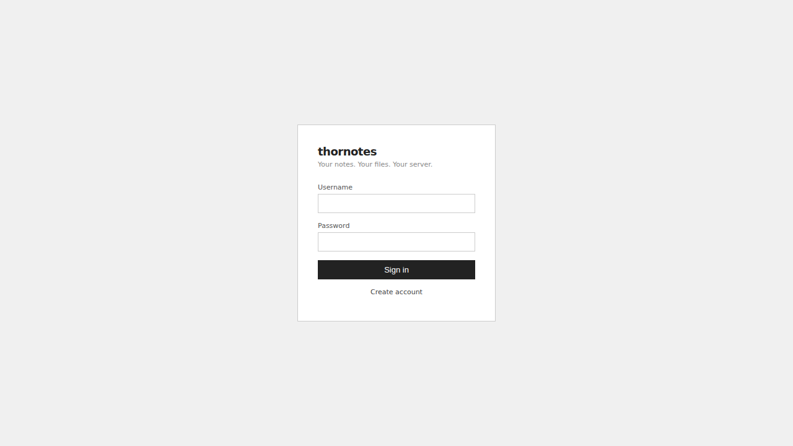
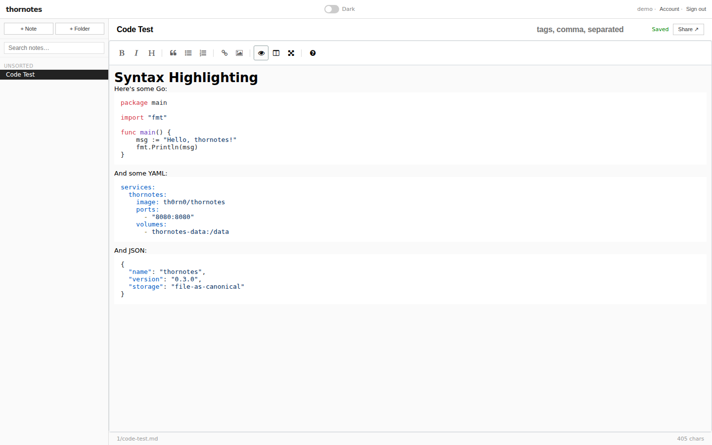
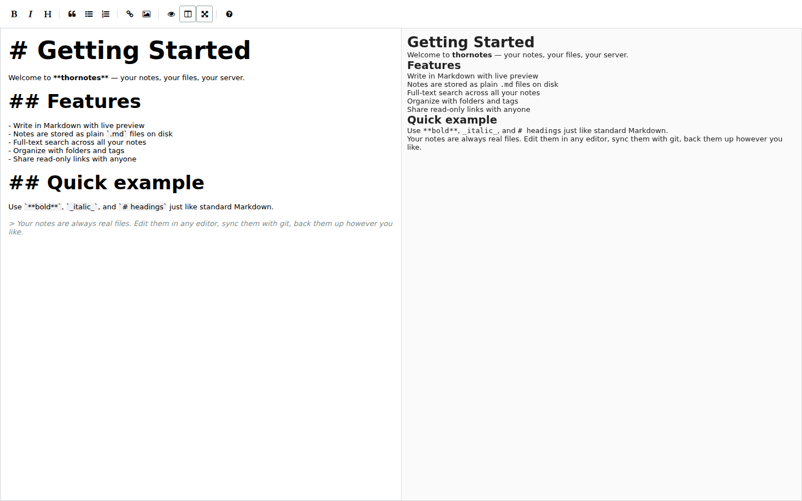
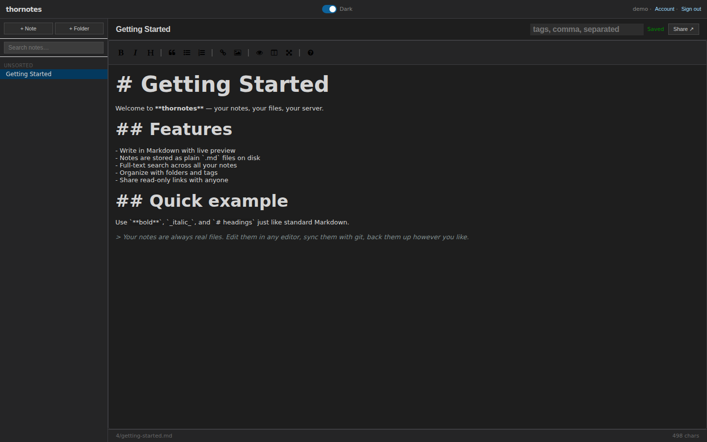

# Thornotes — How-To Guide

Thornotes is a self-hosted markdown notes app. Every note is a real `.md` file on disk — your data is always yours, readable by any text editor.

---

## Table of Contents

1. [Getting Started](#getting-started)
2. [Creating Notes](#creating-notes)
3. [The Editor](#the-editor)
4. [Organizing with Folders](#organizing-with-folders)
5. [Using Tags](#using-tags)
6. [Search](#search)
7. [Sharing Notes](#sharing-notes)
8. [Journals](#journals)
9. [Version History](#version-history)
10. [Import](#import)
11. [Themes](#themes)
12. [API Tokens](#api-tokens)
13. [MCP Server (AI Integration)](#mcp-server-ai-integration)
14. [Desktop App](#desktop-app)
15. [Keyboard Shortcuts](#keyboard-shortcuts)

---

## Getting Started

Open Thornotes in your browser. If this is your first time, you'll see the login screen.



**First run:** Click **Register** to create an account. Once you have at least one account, you can disable registration via the `--allow-registration=false` flag (or `THORNOTES_ALLOW_REGISTRATION=false` env var) to prevent new sign-ups.

After logging in you'll land on the main interface: the folder tree on the left, note list in the middle, and editor on the right.

---

## Creating Notes

Click the **+** icon next to any folder (or at the top of the sidebar for a root note) to create a new note. Type a title and press **Enter**.

The title becomes the note's filename on disk — `my-note.md` — and its URL slug. You can rename it later without breaking anything.

**To delete a note:** Open it and press **Delete** (when you're not typing in the editor), or use the delete button in the toolbar. You'll be asked to confirm.

---

## The Editor


The editor is split into two panes: markdown on the left, live preview on the right.

### Formatting Toolbar

The toolbar above the editor gives you quick access to:

| Button | Action |
|--------|--------|
| **B** | Bold (`**text**`) |
| *I* | Italic (`*text*`) |
| H | Heading (cycles H1→H2→H3) |
| `>` | Blockquote |
| `—` | Horizontal rule |
| List | Unordered list |
| 1. | Ordered list |
| `</>` | Inline code |
| `⬚` | Code block |
| 🔗 | Insert link |
| ⊞ | Insert table (opens grid picker) |
| Share | Generate share link |
| History | View version history |
| Undo / Redo | Step through edit history |

**Right-click** anywhere in the editor to get a context menu with the same formatting options applied to your selection.

### Tables

Click the table icon to open an 8×8 grid. Hover to pick your dimensions, then click to insert. The table is inserted as markdown with aligned columns.

You can also paste tab-separated data (e.g. from a spreadsheet) and Thornotes will offer to convert it to a markdown table automatically.

### Syntax Highlighting

Code blocks detect the language from the fence tag and highlight accordingly. 180+ languages are supported.



Dark mode syntax highlighting adapts to your theme:


### Auto-Save

Thornotes saves automatically 1.5 seconds after you stop typing. The status indicator in the top-right of the editor shows **Saved**, **Saving…**, or **Unsaved** at all times.

### Wiki-Style Links

Link to other notes with `[[Note Title]]` syntax. In the preview pane, these render as clickable links that navigate to the referenced note.

### Preview Mode



Click the preview/edit toggle to switch to a full-width rendered view. The editor collapses and you get a clean reading experience.

---

## Organizing with Folders

The left sidebar is your folder tree. Click a folder to expand it and see its notes. Click the folder *name* (not the arrow) to open a card overview showing all notes inside with their first few lines as a preview.

**Create a folder:** Click the **+** next to the folder icon at the top of the sidebar, or right-click an existing folder.

**Rename / Move / Delete:** Right-click any folder for options. Deleting a folder deletes everything inside it — notes and subfolders — so be sure before confirming.

**Drag and drop:** Drag any note or folder onto another folder to move it there. Drag to the root area to un-nest it.

Folders nest as deep as you like. The path becomes the file path on disk: `notes/{user-id}/work/projects/roadmap.md`.

---

## Using Tags

Add tags to a note by typing in the **Tags** field at the top of the editor (comma-separated). Press Enter to confirm.

Tags let you cross-reference notes across folders. A note in `work/projects/` can share tags with a note in `personal/ideas/`.

**Browse by tag:** Click **Tags** in the sidebar to open the tag browser. Click a tag to see all notes with that tag. You can select multiple tags — results narrow to notes that have *all* selected tags.

---

## Search

Click the **Search** icon or use the search box at the top of the sidebar. Search runs across note titles and full content. Results show the matching snippet with the search term highlighted and the folder path for context.

Combine search with tag filters: search for a term, then click tags in the filter panel to narrow results to notes that match both the text and the selected tags.

---

## Sharing Notes

Every note can be shared as a read-only public link — no login required for the viewer.

1. Open the note you want to share.
2. Click the **Share** button in the toolbar.
3. A link is generated in the format `https://your-instance.example.com/s/{token}`.
4. Copy and send the link. Anyone with the URL can read the rendered note.

To stop sharing, click Share again and select **Clear token**. The old link immediately stops working. Click Share again to generate a new token if you need to re-share.

---

## Journals

Journals are for regular writing — daily logs, work diaries, mood tracking. Each journal entry is automatically organized into a date-based folder hierarchy.

**Create a journal:** Click **Journals** in the sidebar, then **+ New Journal**. Give it a name (e.g. "Daily", "Work Log").

**Write today's entry:** Select your journal from the dropdown, then click **Today**. Thornotes creates the entry at `{journal}/{year}/{month}/YYYY-MM-DD.md` and opens it in the editor. Click Today on the same day and you get the same note back.

Entries are automatically tagged with `journal entry` and the journal name, so you can find them via the tag browser even without navigating the folder tree.

You can have multiple journals — a personal one, a work one, a fitness log — each with its own independent history.

---

## Version History

> Version history requires `--enable-git-history` at startup. See the [README](../README.md) for setup.

When git history is enabled, every save is committed to a git repository in your notes directory. No git CLI is required — Thornotes includes a pure Go implementation.

**View history:** Click the **History** button in the editor toolbar. A panel shows every version with a timestamp and a preview of that version's content.

**Restore a version:** Click **Restore** on any history entry. Thornotes saves the old content as a new commit (forward-only — history is never rewritten). Your current content before the restore is also committed, so nothing is lost.

What gets tracked:
- Every note save (content changes)
- Note deletions
- Folder renames (all affected file paths updated atomically)

---

## Import

**Single note:** Drag and drop a `.md` file onto the folder tree, or use the import button. The filename becomes the note title. The file content is preserved exactly.

**ZIP archive:** Import a `.zip` containing `.md` files. Thornotes recreates the directory structure inside the ZIP as folders and creates a note for each `.md` file. Files in subdirectories go into the corresponding folder (created automatically).

Maximum import size is 10 MB. Files larger than that need to be split before importing.

---

## Themes

Click the palette icon (bottom of sidebar) to open the theme picker. Available themes:

| Theme | Description |
|-------|-------------|
| **Auto** | Follows your OS light/dark preference |
| **Light** | Clean light mode |
| **Dark** | Dark mode |
| **Catppuccin** | Pastel-toned dark theme |
| **Nord** | Cool blue Arctic-inspired dark theme |
| **Tokyo Night** | Vibrant dark theme with warm highlights |
| **Solarized** | Classic Solarized color scheme |



Your theme choice is saved in the browser and persists across sessions. The **Auto** theme watches for OS preference changes and switches immediately when you toggle dark/light mode at the OS level.

---

## API Tokens

API tokens let you access Thornotes programmatically — from scripts, CI pipelines, or AI assistants.

**Create a token:** Go to **Account** (top-right menu) → **API Tokens** → **New Token**.

Give the token a name, choose a scope, and optionally restrict it to specific folders.

### Token Scopes

| Scope | What it can do |
|-------|---------------|
| `read` | Read notes, folders, tags. Cannot create, edit, or delete. |
| `readwrite` | Full read and write access. |

### Folder Permissions

By default, a token can access all your notes. You can restrict a token to one or more folders:

- Click **Add folder permission** and select a folder.
- The permission cascades to all subfolders automatically.
- If any folder permissions are set, the token *only* sees those folders and their descendants.
- A **root** permission covers notes not in any folder.

You can mix permissions: give a token `read` on one folder and `write` on another (as long as the global scope is `readwrite`).

**Using a token:** Pass it as a Bearer token in the `Authorization` header:

```
Authorization: Bearer tn_your_token_here
```

Tokens are prefixed with `tn_`. The full token value is shown once at creation — copy it then. You can see the prefix and permissions later, but not the full value.

---

## MCP Server (AI Integration)

Thornotes includes a built-in [Model Context Protocol](https://modelcontextprotocol.io) server. This lets AI assistants (Claude, Cursor, etc.) read and write your notes directly.

### Setup

The MCP endpoint is at `https://your-instance.example.com/mcp`. Create a `readwrite` API token and configure your AI client:

**For Claude Code** (`~/.claude/settings.json`):

```json
{
  "mcpServers": {
    "thornotes": {
      "type": "http",
      "url": "https://your-instance.example.com/mcp",
      "headers": {
        "Authorization": "Bearer tn_your_token_here"
      }
    }
  }
}
```

### Available Tools

**Read tools** (any token scope):

| Tool | What it does |
|------|-------------|
| `list_notes` | List notes, optionally filtered by folder |
| `get_note` | Fetch a note's full content and metadata |
| `search_notes` | Full-text search, optionally filtered by tags |
| `list_folders` | Return the complete folder hierarchy |
| `find_folders` | Search folders by name substring |
| `find_notes_by_tag` | Find notes matching one or more tags |
| `list_tags` | List all tags in use |

**Write tools** (`readwrite` tokens only):

| Tool | What it does |
|------|-------------|
| `create_note` | Create a note with title, content, folder, and tags |
| `update_note` | Replace note content (with optimistic concurrency) |
| `rename_note` | Change a note's title or tags |
| `move_note` | Move a note to a different folder |
| `delete_note` | Permanently delete a note |
| `create_folder` | Create a new folder |
| `rename_folder` | Rename a folder (all file paths updated atomically) |
| `move_folder` | Move a folder to a different parent |
| `delete_folder` | Delete a folder and all its contents |

### Notes as Resources

Notes are also exposed as MCP resources at `note://{id}`. AI clients that support the MCP resources interface can browse and read notes directly, without making explicit tool calls.

### Token-Scoped Access

MCP respects all API token permissions. A read-only token can only use read tools. A folder-scoped token only sees the permitted folders. The AI assistant cannot access anything the token isn't permitted to see.

---

## Desktop App

Thornotes ships a Linux desktop app as an AppImage — a self-contained executable that runs without installation.

### Download and Run

1. Download `thornotes-desktop-vX.X.X.X-linux-amd64.AppImage` from the [releases page](https://github.com/th0rn0/thornotes/releases).
2. Make it executable:
   ```bash
   chmod +x thornotes-desktop-*.AppImage
   ```
3. Run it:
   ```bash
   ./thornotes-desktop-*.AppImage
   ```

### First-Time Setup

On first launch a setup dialog asks for your Thornotes server URL (e.g. `http://localhost:8080` or `https://notes.example.com`). Enter the address and click **Save**.

The app opens a native window showing the full Thornotes interface. Your session persists between restarts — you won't need to log in again.

### Start on Login

In the setup dialog, enable **Start on login** to add Thornotes to your XDG autostart. It will launch silently in the background whenever you log in to your desktop.

To change the server URL later, click the settings icon in the corner of the app window.

---

## Keyboard Shortcuts

| Shortcut | Action |
|----------|--------|
| **Delete** | Delete the open note (when not focused in editor) |
| **Escape** | Close modals, context menus, and overlays |
| **Enter** | Confirm in login, register, new note, new folder, and journal modals |
| **Ctrl/Cmd + B** | Bold |
| **Ctrl/Cmd + I** | Italic |

---

## Tips

**Files are always there.** Thornotes stores every note as a plain `.md` file in `notes/{user-id}/`. You can open, edit, or back up your notes with any tool — rsync, git, Obsidian, VS Code, anything.

**External edits sync automatically.** If you edit a `.md` file outside of Thornotes, it detects the change within the watch interval (default 30 seconds) and updates the UI across all open browser tabs.

**Context endpoint for AI.** `GET /api/v1/notes/context` returns all your notes concatenated into one block — useful for feeding your full knowledge base to an LLM in a single request. Optionally scope it to a folder with `?folder_id=123`. Truncates at 200,000 characters.

**Disable registration after setup.** Once you've created your account(s), restart Thornotes with `--allow-registration=false` (or `THORNOTES_ALLOW_REGISTRATION=false`) to close public sign-up.

**HTTPS in production.** Set `THORNOTES_SECURE_COOKIES=true` when running behind a TLS reverse proxy. This sets the `Secure` flag on session cookies. Also set `THORNOTES_TRUSTED_PROXY` to the CIDR of your proxy so rate limiting works correctly.
